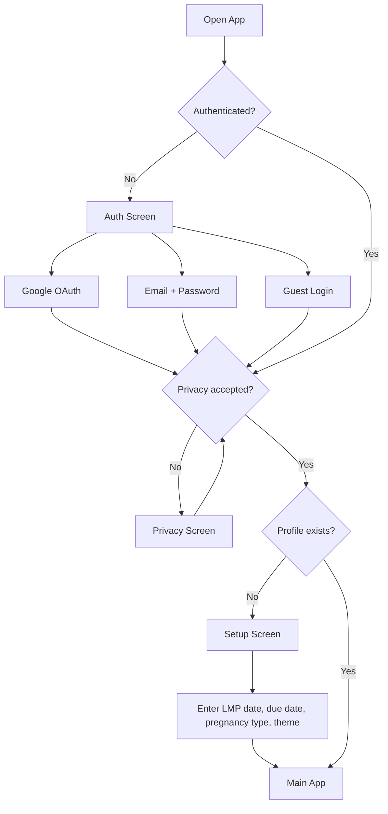
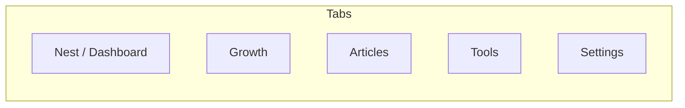
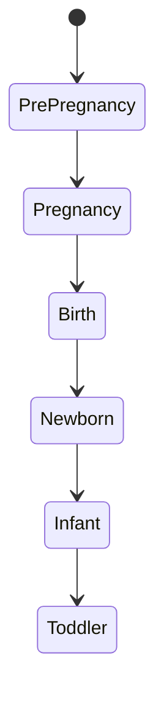
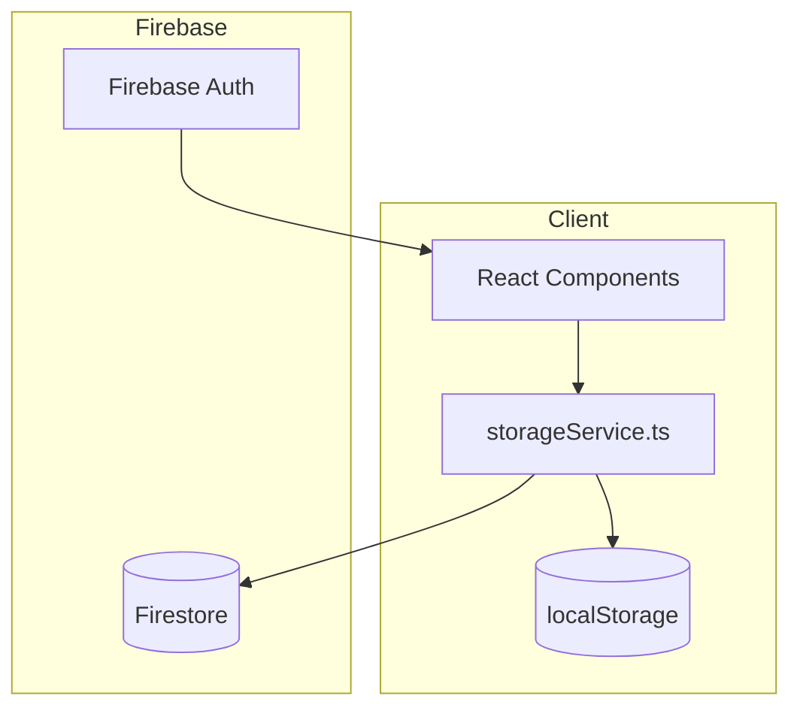
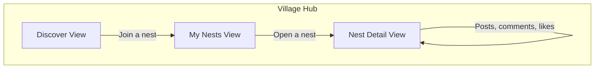

# Nestly App Guide

Mobile-first PWA for pregnancy tracking, postpartum monitoring, and baby care.

## User flow



## Navigation

5 tabs controlled by `activeTab` state in `App.tsx`. No router library.



Desktop: collapsible sidebar on the left. Mobile: fixed bottom nav bar with horizontal scroll.

## Lifecycle stages

The app adapts features based on where the user is in their journey.



Trimester is calculated from the LMP (last menstrual period) date:
- First trimester: weeks 0-12
- Second trimester: weeks 13-26
- Third trimester: week 27+
- Auto-transitions to Newborn at EDD (280 days from LMP)

Tools, dashboard widgets, and education content change based on stage.

## Data architecture



All personal data (logs, profile, settings) lives in localStorage, scoped by user email.
Village Hub (nests, posts, comments) uses Firestore with real-time subscriptions.
There is no server database for personal data. PDF export is the only way to share data with a provider.

## Screens

### Dashboard

The home screen. Shows different widgets depending on lifecycle stage.

**Pregnancy mode:**
- Nutrition tracking with calorie counter and macros
- Weight graph (Recharts line chart)
- Sleep tracker with quality ratings
- Vitamin logging
- Food picker (offline WHO-aligned nutrition lookup)
- Medication tracker
- Randomized WHO-based pregnancy tips

**Newborn/postpartum mode:**
- Feeding tracker (breast/bottle/formula/solid)
- Baby selection dropdown (multi-baby support)
- Sleep quality tracking
- Milestones
- Health logs (temperature, vaccinations)
- Baby growth charts (weight, height, head circumference)
- Diaper log counts
- Randomized newborn care tips

### Tools Hub

25 tools organized by lifecycle stage. User picks a tool from a grid, it opens full-screen.

**Pregnancy tools (16):**
Medications, Baby Names, Bump Photos, Sleep, Calendar, Checklists, Memories, Kegels, Journal, Contractions, Kicks, Reactions, Calm, Reports, Symptoms, Nutrition, Vitamins

**Newborn/postpartum tools (18):**
Feeding, Sleep, Diaper, Milestones, Health, Medications, Tummy Time, Bath, Pumping, Teething, Journal, Export PDF, Calendar, Checklists, Memories, Symptoms, Nutrition, Vitamins

What each tool does:

| Tool | What it does |
|------|-------------|
| Symptoms | Log preset symptoms (nausea, headache, fatigue, etc.) with severity |
| Contractions | Timer for labor contractions, tracks duration and frequency |
| Kicks | Fetal kick counting sessions |
| Sleep | Sleep logging with quality ratings, works in pregnancy and newborn modes |
| Nutrition | Food entry tracking with calories and nutrients |
| Vitamins | Daily vitamin supplement logging |
| Medications | Track medication names, dosages, timing |
| Calendar | Manual appointment and reminder calendar |
| Checklists | Preparation checklists: hospital bag, birth plan, nursery, general |
| Journal | Free-form text journaling with mood |
| Bump Photos | Pregnancy progress photos by week |
| Memories | Photo albums: bump, baby, ultrasound, nursery, family, other |
| Baby Names | Save and manage name ideas |
| Kegels | Pelvic floor exercise timer |
| Calm | Guided calming exercises |
| Reactions | Log fetal/baby reactions to stimuli (music, food, voice) |
| Reports | Data analysis and reporting interface |
| Export PDF | Generate PDF of all logged data |
| Feeding | Track breastfeeding, bottle, formula, solids with amounts |
| Diaper | Log diaper changes (wet/dirty/mixed) |
| Milestones | Baby developmental milestone tracking |
| Health | Temperature, medications, vaccinations, symptoms for baby |
| Tummy Time | Tummy time session logging with duration |
| Bath | Bath tracking |
| Pumping | Breast pump session logging |
| Teething | Teething symptom tracking |

### Village Hub

Community space built on Firestore. Users join "Nests" (topic groups).



**Nest categories:** Trimester, Lifestyle, Diet, Support, Postpartum, General

**Discover view:** search, sort (popular/newest), filter by category, browse all nests
**My Nests view:** list of joined nests, create custom nest
**Nest Detail view:** posts feed, create posts, comments with reply threads, likes on posts and comments, share posts

8 template nests are seeded via `scripts/seedVillage.ts`. Users can create custom nests.
All data (nests, posts, comments, memberships) lives in Firestore with security rules.

### Education Hub

Curated links to external articles from Mayo Clinic, NHS, WHO, CDC, March of Dimes.
4 categories: Pregnancy Health, Baby Development, Nutrition, Newborn Care.
Content filtered by trimester. Stage-specific guidance (feelings, what's happening, focus areas).

### Settings

- Edit username and profile photo
- Change password
- Manage babies (add/remove, set name, gender, skin tone, birth date, weight, length)

### Auth Screen

Three login methods: Google OAuth, Email/Password (signup + signin), Anonymous Guest.
Includes PWA install instructions for iOS and Android.

## Theming

3 color themes: pink (default), blue, orange. Applied via CSS class on body (`theme-pink`, etc.).
Also adapts to lifecycle stage (`stage-pregnancy`, `stage-newborn`).
Glassmorphism effects with backdrop blur on navigation and headers.
Floating teddy bear background animation.

## Storage keys

All user data in localStorage, prefixed with user email for multi-user support.
Guest users get `guest_` prefix. Key examples: `user@email.com_profile_v5`, `user@email.com_food_entries`.

19 tracking log types, 4 chat/memory keys, 8 global keys, 4 village keys.

## Monorepo structure

```
packages/
  shared/        @nestly/shared - types, firebase, services (village, sync, growth)
  web/           @nestly/web - React app, components, web-specific services
  mobile/        placeholder for future React Native app
api/             Vercel serverless functions (push)
scripts/         Seed scripts
tests/           Vitest unit tests
```
