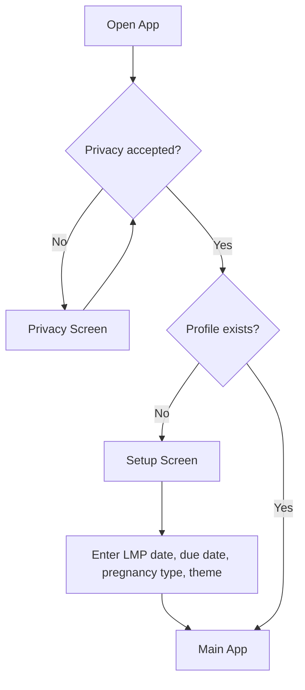
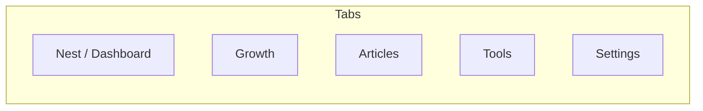
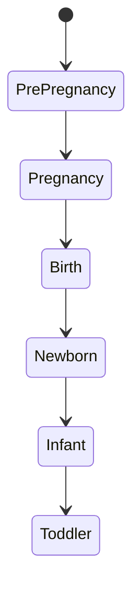
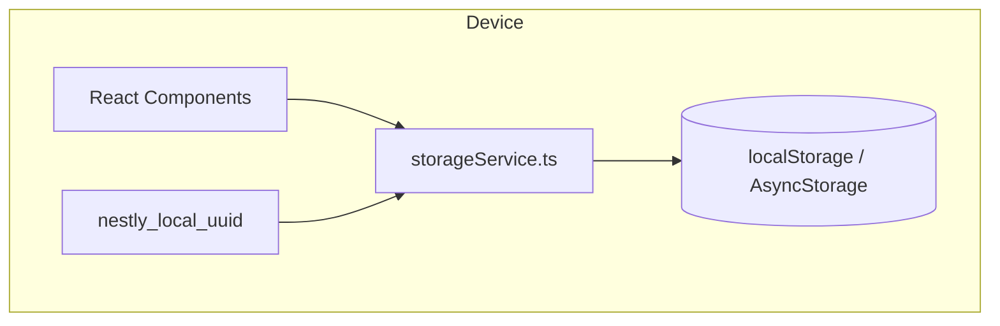

# Nestly App Guide

Mobile-first pregnancy tracking, postpartum monitoring, and baby care. Shipped as a web PWA and an Android app, both running a Zero-Data architecture: all personal tracking data lives on the user's device. Nothing is sent to a server we control.

## User flow



No sign-in. On first launch the app generates a random UUIDv4 and stores it locally (`nestly_local_uuid`). That UUID keys every storage record on this device. There is no account, no password, no sync.

## Navigation

5 tabs controlled by `activeTab` state in `App.tsx`. No router library.



Desktop: collapsible sidebar on the left. Mobile (PWA and Android): fixed bottom nav bar with horizontal scroll.

## Lifecycle stages

The app adapts features based on where the user is in their journey.



Trimester is calculated from the LMP (last menstrual period) date:
- First trimester: weeks 0-12
- Second trimester: weeks 13-26
- Third trimester: week 27+
- Auto-transitions to Newborn at EDD (280 days from LMP)

Tools, dashboard widgets, and education content change based on stage.

## Data architecture



All personal data (logs, profile, settings, vitals, journal, media references) lives on the device, scoped by a local UUID stored on this device. Web uses `localStorage` via `storageService`; the Android app uses `AsyncStorage`. The same record is never visible to any other device, user, or server.

There is no server database. Export / Import / Delete-all-data in Settings is the only way data leaves or re-enters the app. Doctor Summary PDF is the only way data is shared with a healthcare provider.

## Screens

### Dashboard

The home screen. Shows different widgets depending on lifecycle stage.

**Pregnancy mode:**
- Nutrition tracking with calorie counter and macros
- Weight graph (Recharts line chart)
- Sleep tracker with quality ratings
- Vitamin logging
- Food picker (offline WHO-aligned nutrition lookup)
- Medication tracker
- Randomized WHO-based pregnancy tips

**Newborn/postpartum mode:**
- Feeding tracker (breast/bottle/formula/solid)
- Baby selection dropdown (multi-baby support)
- Sleep quality tracking
- Milestones
- Health logs (temperature, vaccinations)
- Baby growth charts (weight, height, head circumference)
- Diaper log counts
- Randomized newborn care tips

### Tools Hub

Tools organized by lifecycle stage. User picks a tool from a grid, it opens full-screen.

**Pregnancy tools:** Symptoms, Contractions, Kicks, Sleep, Nutrition, Vitamins, Medications, Appointments, Checklists, Journal, Bump Diary, Memories, Baby Names, Kegels, Calm, Reactions, Vitals, Reports

**Newborn/postpartum tools:** Feeding, Sleep, Diaper, Milestones, Health, Medications, Tummy Time, Bath, Pumping, Teething, Journal, Appointments, Checklists, Memories, Symptoms, Nutrition, Vitamins, Reports, Export PDF

What each tool does:

| Tool | What it does |
|------|-------------|
| Symptoms | Log preset symptoms (nausea, headache, fatigue, etc.) with severity |
| Contractions | Timer for labor contractions, tracks duration and frequency |
| Kicks | Fetal kick counting sessions |
| Sleep | Sleep logging with quality ratings, works in pregnancy and newborn modes |
| Nutrition | Offline food picker backed by `nutrition.ts` (WHO/USDA-aligned, Zimbabwean staples). Logs entries with calories, protein, folate, iron, calcium. Airplane-mode safe. |
| Vitamins | Daily vitamin supplement logging |
| Medications | Track medication names, dosages, timing |
| Appointments | Manual appointment and reminder calendar |
| Checklists | Preparation checklists: hospital bag, birth plan, nursery, general |
| Journal | Free-form text journaling with mood |
| Bump Diary | Pregnancy progress photos by week |
| Memories | Photo albums: bump, baby, ultrasound, nursery, family, other |
| Baby Names | Save and manage name ideas |
| Kegels | Pelvic floor exercise timer |
| Calm | Guided calming exercises |
| Reactions | Log fetal/baby reactions to stimuli (music, food, voice) |
| Reports | Data analysis and reporting interface |
| Export PDF | Generate PDF of all logged data, or a 14-day Doctor Summary PDF |
| Vitals | Weight, blood pressure, temperature logs |
| Feeding | Track breastfeeding, bottle, formula, solids with amounts |
| Diaper | Log diaper changes (wet/dirty/mixed) |
| Milestones | Baby developmental milestone tracking |
| Health | Temperature, medications, vaccinations, symptoms for baby |
| Tummy Time | Tummy time session logging with duration |
| Bath | Bath tracking |
| Pumping | Breast pump session logging |
| Teething | Teething symptom tracking |

### Education Hub

Curated links to external articles from Mayo Clinic, NHS, WHO, CDC, March of Dimes.
4 categories: Pregnancy Health, Baby Development, Nutrition, Newborn Care.
Content filtered by trimester. Stage-specific guidance (feelings, what's happening, focus areas).

### Settings

- Edit username and profile photo
- Manage babies (add/remove, set name, gender, skin tone, birth date, weight, length)
- Theme picker
- **Your Data** card:
  - Export all tracking data as a JSON file (web: "Export data" / Android: "Back up my data")
  - Doctor Summary PDF (14-day window with vitals, trackers, nutrition averages, symptoms)
  - Import a previously exported JSON file to restore on a new device (web: "Import data" / Android: "Restore from a backup")
  - **Delete all data** (typed-DELETE confirmation)

## Theming

12 color themes selectable in Settings. Applied via CSS class on body (`theme-pink`, etc.).
Also adapts to lifecycle stage (`stage-pregnancy`, `stage-newborn`).
Glassmorphism effects with backdrop blur on navigation and headers.
Floating teddy bear background animation.

## Storage keys

All user data lives on device, scoped by the locally generated UUIDv4 (`nestly_local_uuid`). Legacy installs that were created before the Zero-Data migration still have email-prefixed keys until the one-time migration runs.

- Web: `localStorage`, keys of the form `{uuid}_profile_v5`, `{uuid}_food_entries`, etc.
- Android: `AsyncStorage` with the same key shape.

19 tracking log types, 4 chat/memory keys, and a small set of global keys (non-user-scoped, e.g. the UUID itself and the privacy consent flag).

## Monorepo structure

```
packages/
  shared/        @nestly/shared - types, stores, design tokens, Zero-Data export schema, migrations
  web/           @nestly/web - React 19 PWA (Vite + Tailwind + Lucide)
  mobile/        @nestly/mobile - Expo SDK 54 + React Native 0.81 (NativeWind + Ionicons)
api/             Vercel serverless functions (currently only static health/unsubscribe)
docs/            Project docs (this file, legal, architecture notes)
scripts/         Build and release tooling
tests/           Vitest unit tests (web)
```
