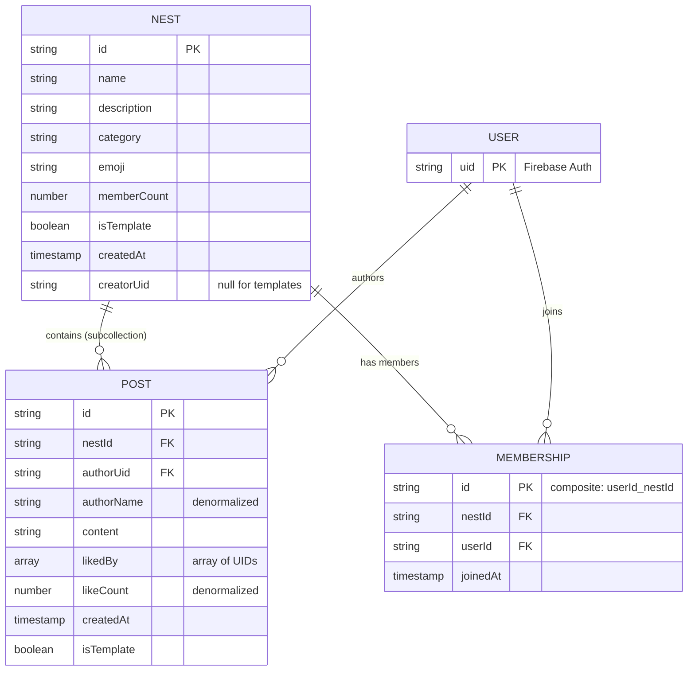
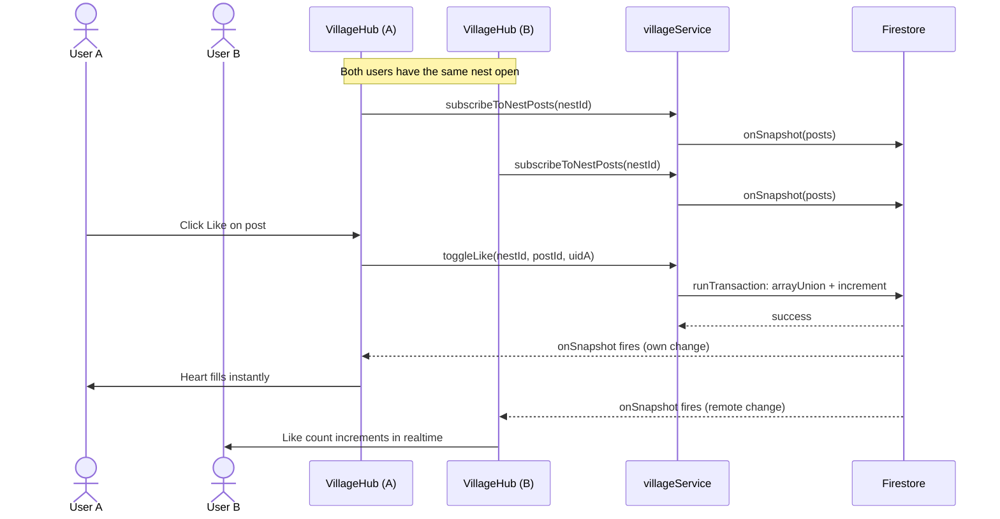

# Village Hub: Firestore architecture

Technical overview of the Village Hub Firestore migration (PR #124, closes foundation scope of #110).

## What changed

Village Hub was previously a localStorage-only feature, which meant every user saw their own isolated copy of posts, nests, and memberships. For a community feature (shared posts, groups, interactions) this is fundamentally broken. This migration moves Village Hub to Firestore so that posts and memberships are genuinely shared across users and devices, with realtime updates.

Everything else in Nestly (pregnancy logs, feeding, sleep, food entries, etc.) stays on localStorage. Only Village Hub moves.

## Data model

Three new Firestore collections were introduced:



Firestore paths:

```
nests/{nestId}
nests/{nestId}/posts/{postId}
memberships/{userId}_{nestId}
```

### Design choices

**Posts as a subcollection of nests.** The dominant query is "get all posts in nest X sorted by time", which maps directly to `collection('nests/{id}/posts').orderBy('createdAt', 'desc')`. There is no cross-nest feed requirement in the current scope.

**Memberships as a top-level collection, not a subcollection.** The two primary membership queries are (a) "which nests has user X joined?" and (b) "how many members does nest Y have?". A top-level collection lets us do simple `where('userId', '==', uid)` queries for (a) without needing collection group queries. The composite document ID `{userId}_{nestId}` enforces uniqueness without a separate constraint.

**Likes as an array on the post document.** At this scale, `likedBy: string[]` is adequate. The 1MB Firestore document limit allows tens of thousands of UIDs per post. A subcollection for likes would add read cost and complexity with zero benefit. The `likeCount` field is denormalized for display efficiency and is always derivable from `likedBy.length`.

**`memberCount` is denormalized on the nest document.** Avoids counting membership docs on every render. Kept in sync via `increment(1)` and `increment(-1)` in batch writes alongside membership create/delete. Security rules enforce the +/-1 delta.

**`authorName` is denormalized on the post document.** Trade-off: if a user edits their profile name later, a Cloud Function will be needed to update it across all their posts. Acceptable for now to avoid a user profile read per post.

## Service layer

`services/villageService.ts` is a thin wrapper around Firestore that exposes:

| Function | Purpose |
|----------|---------|
| `subscribeToNests(cb)` | Realtime listener for all nests, ordered by memberCount desc |
| `subscribeToUserMemberships(uid, cb)` | Realtime listener for user's joined nests |
| `subscribeToNestPosts(nestId, cb)` | Realtime listener for a nest's posts, ordered by createdAt desc |
| `createNest(input, uid)` | Atomic: creates nest + auto-joins creator in a batch |
| `deleteNest(nestId)` | Cascade delete: removes nest + all posts + all memberships |
| `joinNest(nestId, uid)` | Batch: creates membership + increments memberCount |
| `leaveNest(nestId, uid)` | Batch: deletes membership + decrements memberCount |
| `createPost(nestId, input)` | Adds a post document |
| `deletePost(nestId, postId)` | Deletes a post document |
| `toggleLike(nestId, postId, uid)` | Transaction: toggles user in likedBy array, adjusts likeCount |

All write operations return `Promise<void>` for error handling in the component. All subscribe functions return an `Unsubscribe` callback for `useEffect` cleanup.

## Realtime flow

The previous implementation used a manual `rerender()` tick to force re-reads from localStorage after every mutation. This is replaced by Firestore's `onSnapshot` listeners, which push updates automatically whenever the underlying documents change, whether the change came from the current user or from another user on another device.



The `rerender()` tick pattern is completely eliminated. Component state updates are driven entirely by Firestore listener callbacks.

## Security rules

Rules live in `firestore.rules` and enforce:

| Resource | Read | Create | Update | Delete |
|----------|------|--------|--------|--------|
| `nests/{id}` | any authenticated user | any authenticated user if `creatorUid == auth.uid` | only `memberCount` field, delta must be +/-1 | only if `creatorUid == auth.uid` |
| `nests/{id}/posts/{pid}` | any authenticated user | any authenticated user if `authorUid == auth.uid` | only `likedBy` and `likeCount` fields, likeCount delta must be +/-1 | only if `authorUid == auth.uid` |
| `memberships/{id}` | any authenticated user | any authenticated user if `userId == auth.uid` | forbidden (immutable) | only if `userId == auth.uid` |

Field-level update restrictions (via `request.resource.data.diff(resource.data).affectedKeys().hasOnly(...)`) prevent tampering with post content, authorUid, creatorUid, or bulk counter manipulation. Without these constraints, any authenticated user could edit anyone else's post content via a direct Firestore write.

## Template nests and seed posts

Eight template nests remain (first trimester, second trimester, third trimester, vegan pregnancy, working moms, twin pregnancy, newborn circle, gentle parenting). They are stored in Firestore the same way as user-created nests, with `isTemplate: true` and `creatorUid: null`.

The previous fake seed posts attributed to invented people (Sarah M., Emma K., etc.) are removed. They were flagged in issue #110 as impersonation. Replacement seed posts are rewritten as welcome messages authored by `Village Team` (`authorUid: 'system'`, `isTemplate: true`).

Template nests and seed posts are populated by a one-time script `scripts/seedVillage.ts` using `firebase-admin`. The script is idempotent (uses fixed IDs `tmpl-1` through `tmpl-8`, `seed-1` through `seed-15`) so it can be re-run safely. Deploy instructions are in `docs/village-hub-firestore-deploy.md`.

## Component changes

`components/VillageHub.tsx` now accepts a `userUid: string | null` prop, passed from `App.tsx`. When `userUid` is null (signed-out state) the component renders a sign-in prompt instead of community content.

The component subscribes to nests and memberships in a top-level `useEffect`, and the `NestDetailView` sub-component subscribes to that specific nest's posts in its own `useEffect`. All three listeners return their `Unsubscribe` functions from the effect cleanup, so they are properly torn down when the component unmounts or dependencies change.

A loading state is shown while the initial listener data is being fetched. Handlers for join, leave, create, post, like, and delete are async and include try/catch error handling with user-facing alerts.

The delete button on a post is only rendered when `post.authorUid === userUid`. The delete button on a nest is only rendered when `nest.creatorUid === userUid`.

## What is NOT in this PR

Issue #110 has been split. Only the foundation lands here. The following features requested by @tanakaprince49-cell after UI direction was confirmed are tracked separately:

| Issue | Scope |
|-------|-------|
| #116 | Admin roles and moderation (delete any post, ban users, hide posts, max 5 admins per nest) |
| #117 | Invite links for joining and for promoting admins (24h expiry on admin links) |
| #118 | Media posts (images and video), Firebase Storage setup |
| #119 | Stories (admin only, Instagram-style, 24h expiry) |
| #120 | Hashtags and user mentions |
| #121 | Comments subcollection and share action |
| #122 | Discover screen with search |
| #123 | User profile identity (displayName and avatar from signup) |

Each follow-up issue has dependency annotations and can proceed in parallel where dependencies allow.

## Files touched

New:
- `services/villageService.ts`
- `scripts/seedVillage.ts`
- `docs/village-hub-firestore.md`
- `docs/village-hub-firestore-deploy.md`

Modified:
- `firebase.ts` (Firestore init)
- `types.ts` (Nest, NestMembership, NestPost)
- `firestore.rules` (nests, posts, memberships)
- `services/villageTemplates.ts` (no impersonation)
- `components/VillageHub.tsx` (Firestore listeners, loading state, error handling)
- `services/storageService.ts` (removed dead Village methods)
- `App.tsx` (passes userUid to VillageHub)

Deleted:
- `tests/services/villageStorage.test.ts`
- `tests/e2e/village-hub-storage.spec.ts`
- `tests/e2e/village-hub-live.spec.ts`

All deletions are obsolete tests for the removed localStorage-based Village methods.
